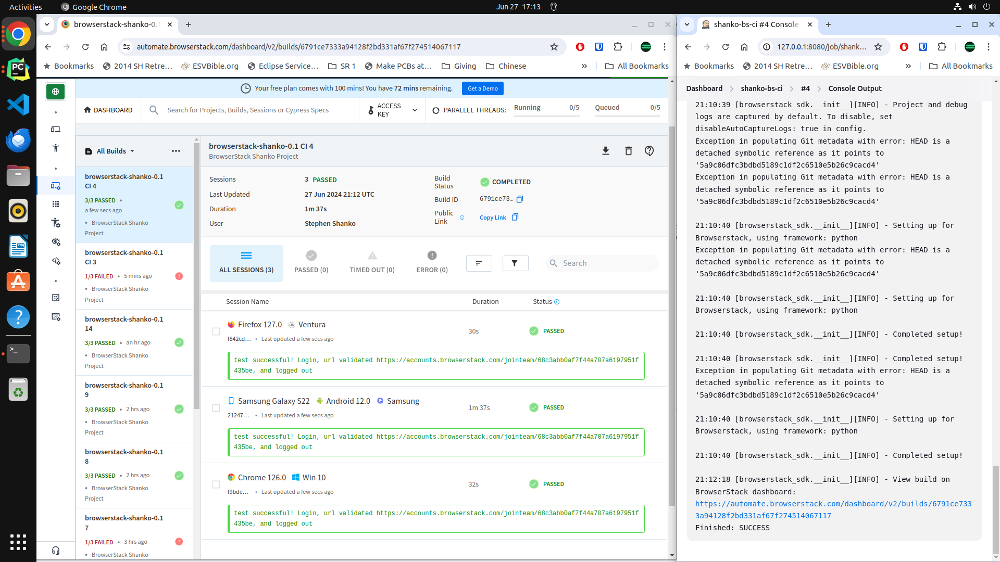
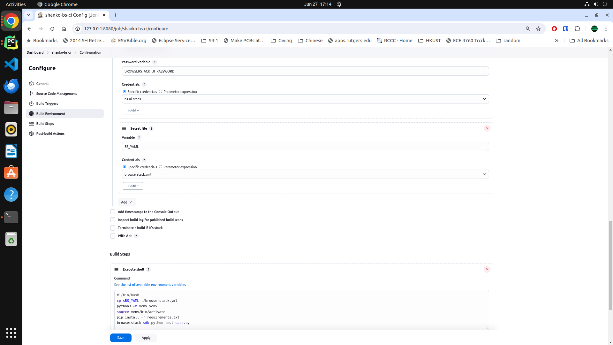

# To run in browserstack, do the following:

1. Update `browserstack.yml` with your userName and accessKey
2. Set the `BROWSERSTACK_UI_USER` and `BROWSERSTACK_UI_PASSWORD` environment variables so the selenium test can log you into the website
3. Run `pip install -r requirements.txt`
4. Launch your tests `browserstack-sdk python test-case.py`

Results look as follows:
## Pipeline run and Dashboard

## Jenkins Configuration with secrets

